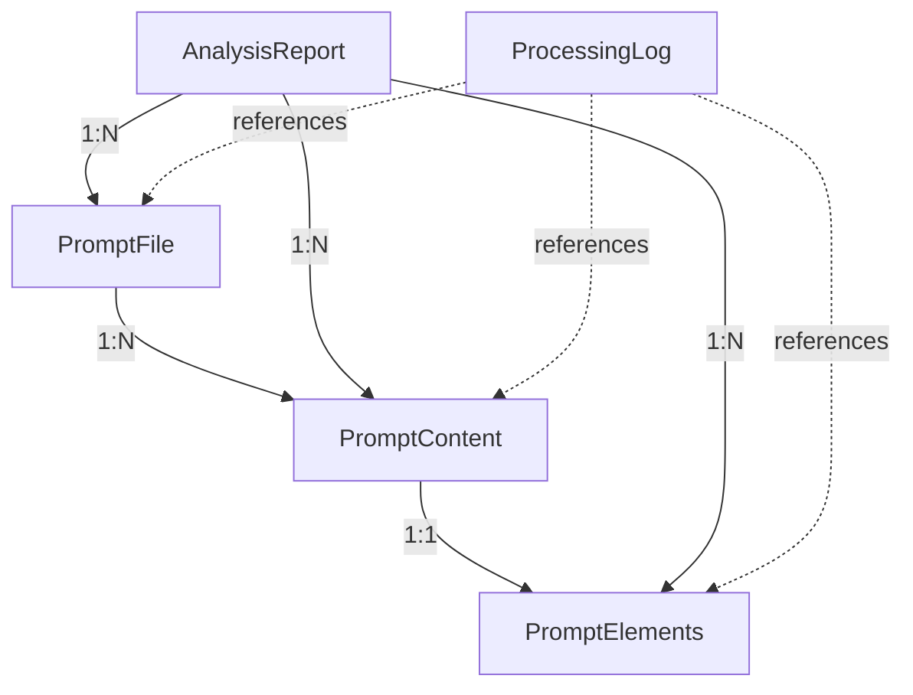

# Data Model: AI 提示词分析工作流

**Feature**: 001-ai-ai-ai | **Date**: 2025-09-13 | **Derived from**: spec.md functional requirements

## Entity Overview

从功能需求中提取的核心实体及其关系，支持完整的提示词分析工作流。

## Core Entities

### 1. PromptFile (提示词文件)

**Purpose**: 表示仓库中可能包含提示词内容的源文件

```typescript
interface PromptFile {
  // 标识信息
  filePath: string;           // 相对于仓库根目录的路径
  fileName: string;           // 文件名（不含路径）
  fileExtension: string;      // 文件扩展名（如 .md, .txt, .py）

  // 文件元信息
  fileSize: number;          // 文件大小（字节）
  lastModified: Date;        // 最后修改时间
  encoding: string;          // 文件编码（UTF-8等）

  // 处理状态
  scanStatus: ScanStatus;    // 扫描状态
  scanTimestamp: Date;       // 扫描时间
  errorMessage?: string;     // 错误信息（如果有）
}

enum ScanStatus {
  PENDING = "pending",       // 待处理
  PROCESSING = "processing", // 处理中
  COMPLETED = "completed",   // 已完成
  FAILED = "failed",         // 处理失败
  SKIPPED = "skipped"        // 已跳过
}
```

**Validation Rules**:
- filePath: 必须相对路径，不能为空
- fileSize: >= 0
- scanTimestamp: 必须有效日期

### 2. PromptContent (提示词内容)

**Purpose**: 表示从文件中识别和提取的提示词文本内容

```typescript
interface PromptContent {
  // 关联信息
  contentId: string;         // 唯一标识符
  sourceFile: string;        // 来源文件路径

  // 内容信息
  originalText: string;      // 原始提示词文本
  cleanedText: string;       // 清理后的文本（去除格式等）
  language: Language;        // 主要语言
  contentType: ContentType;  // 内容类型

  // 检测结果
  isPrompt: boolean;         // 是否为提示词
  confidence: number;        // 置信度 (0.0 - 1.0)
  detectionMethod: string;   // 检测方法标识

  // 位置信息
  startPosition?: number;    // 文件中的开始位置
  endPosition?: number;      // 文件中的结束位置
  lineRange?: {              // 行号范围
    start: number;
    end: number;
  };
}

enum Language {
  CHINESE = "zh",
  ENGLISH = "en",
  MIXED = "mixed",
  OTHER = "other"
}

enum ContentType {
  SYSTEM_PROMPT = "system",
  USER_PROMPT = "user",
  ASSISTANT_PROMPT = "assistant",
  CONVERSATION = "conversation",
  CODE_COMMENT = "code_comment",
  DOCUMENTATION = "documentation",
  CONFIGURATION = "configuration"
}
```

**Validation Rules**:
- originalText: 长度 >= 10 字符
- confidence: 0.0 <= confidence <= 1.0
- contentId: 唯一且格式为 UUID

### 3. PromptElements (提示词要素)

**Purpose**: 表示分析后的13个框架要素结构化数据

```typescript
interface PromptElements {
  // 关联信息
  elementId: string;         // 唯一标识符
  contentId: string;         // 关联的内容ID

  // 13个标准化要素
  sourceFile: string;        // 所在文件
  roleAbility: ElementData;  // 角色/能力
  taskRequest: ElementData;  // 任务/请求
  contextSituation: ElementData; // 背景/情境
  instructionAction: ElementData; // 指令/行动
  outputSpec: ElementData;   // 输出规格
  examples: ElementData;     // 示例
  constraints: ElementData;  // 限制/约束
  objectives: ElementData;   // 目标/期望
  information: ElementData;  // 信息
  evaluation: ElementData;   // 评估/优化
  adjustment: ElementData;   // 调整
  audience: ElementData;     // 受众

  // 分析元信息
  analysisTimestamp: Date;   // 分析时间
  analysisModel: string;     // 使用的AI模型
  completeness: number;      // 完整性评分 (0-1)
  qualityScore: QualityScore; // 质量评级
}

interface ElementData {
  present: boolean;          // 是否存在该要素
  content?: string;          // 要素内容
  confidence: number;        // 置信度 (0.0-1.0)
  extractedText?: string;    // 原文摘录
  position?: {               // 在原文中的位置
    start: number;
    length: number;
  };
}

enum QualityScore {
  A = "A",  // 优秀 (>= 90% 要素完整)
  B = "B",  // 良好 (>= 70% 要素完整)
  C = "C",  // 中等 (>= 50% 要素完整)
  D = "D",  // 较差 (>= 30% 要素完整)
  F = "F"   // 不合格 (< 30% 要素完整)
}
```

**Validation Rules**:
- completeness: 0.0 <= completeness <= 1.0
- ElementData.confidence: 0.0 <= confidence <= 1.0
- 至少3个要素的present为true（最低质量要求）

### 4. AnalysisReport (分析报告)

**Purpose**: 表示完整的分析结果汇总和统计信息

```typescript
interface AnalysisReport {
  // 报告基本信息
  reportId: string;          // 报告唯一标识
  projectPath: string;       // 分析的项目路径
  createdAt: Date;           // 创建时间
  version: string;           // 工具版本

  // 扫描统计
  scanSummary: {
    totalFiles: number;      // 总文件数
    scannedFiles: number;    // 已扫描文件数
    promptFiles: number;     // 包含提示词的文件数
    failedFiles: number;     // 失败文件数
    skippedFiles: number;    // 跳过文件数
  };

  // 内容统计
  contentSummary: {
    totalPrompts: number;    // 总提示词数
    byLanguage: Record<Language, number>; // 按语言分布
    byType: Record<ContentType, number>;  // 按类型分布
    avgConfidence: number;   // 平均置信度
  };

  // 要素统计
  elementSummary: {
    avgCompleteness: number; // 平均完整性
    qualityDistribution: Record<QualityScore, number>; // 质量分布
    elementFrequency: Record<string, number>; // 各要素出现频率
    topMissingElements: string[]; // 最常缺失的要素
  };

  // 性能统计
  performance: {
    processingTime: number;  // 处理总时间（毫秒）
    apiCallsCount: number;   // API调用次数
    totalTokens: number;     // 消耗token总数
    avgTimePerFile: number;  // 平均每文件处理时间
  };

  // 详细结果
  files: PromptFile[];       // 所有文件信息
  contents: PromptContent[]; // 所有内容信息
  elements: PromptElements[]; // 所有要素信息
}
```

**Validation Rules**:
- scanSummary中各计数器总和应一致
- 平均值应在有效范围内
- files/contents/elements数组关系应一致

### 5. ProcessingLog (处理日志)

**Purpose**: 记录详细的处理过程和错误信息

```typescript
interface ProcessingLog {
  logId: string;             // 日志唯一标识
  timestamp: Date;           // 时间戳
  level: LogLevel;           // 日志级别
  source: string;            // 来源模块
  message: string;           // 日志消息

  // 上下文信息
  filePath?: string;         // 相关文件路径
  contentId?: string;        // 相关内容ID
  errorCode?: string;        // 错误代码
  stackTrace?: string;       // 错误堆栈

  // 性能信息
  duration?: number;         // 操作耗时
  memoryUsage?: number;      // 内存使用量
  apiResponse?: {            // API响应信息
    model: string;
    tokens: number;
    latency: number;
  };
}

enum LogLevel {
  DEBUG = "debug",
  INFO = "info",
  WARN = "warn",
  ERROR = "error",
  FATAL = "fatal"
}
```

## Entity Relationships



## State Transitions

### PromptFile State Flow
```
PENDING → PROCESSING → COMPLETED
        ↓           ↘ FAILED
        SKIPPED
```

### Analysis Pipeline Flow
```
File Scan → Content Detection → Element Analysis → Report Generation
```

## Storage Format

所有数据将以JSON格式存储到 `./analysis/` 目录：

- `analysis-report-YYYYMMDD-HHMMSS.json`: 主报告文件
- `processing.log`: 处理日志文件
- `cache/`: 缓存目录（可选）

## Performance Considerations

- PromptContent.originalText 使用字符串截断（最大50KB）
- ProcessingLog 使用循环缓冲（最大1000条）
- 大型项目支持分批处理和增量更新
- 索引优化：按filePath、contentType、qualityScore建立快速查找

---
*Data model supports all functional requirements FR-001 through FR-010*